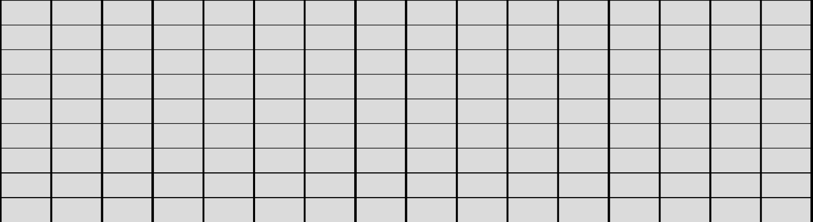
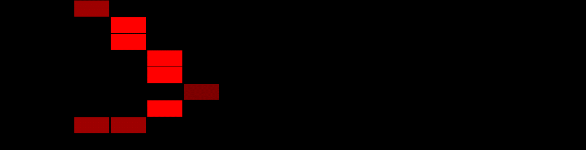
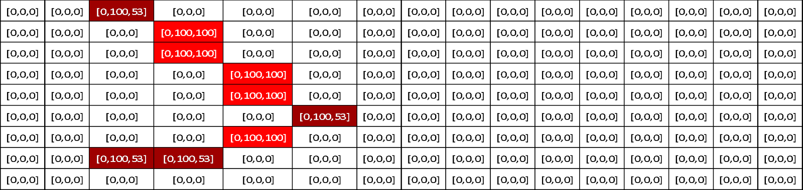
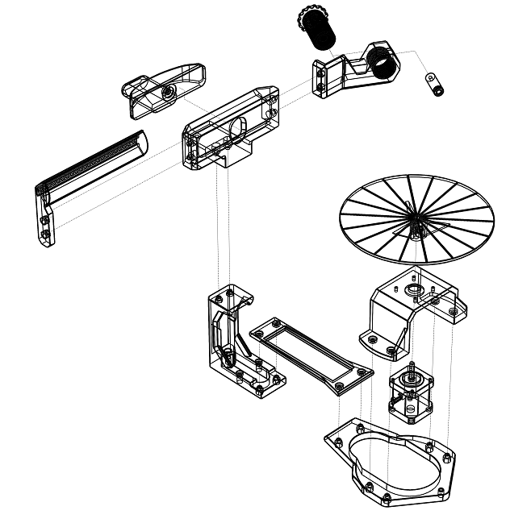

    

        
<h1 align="center">Escáner 3D por Triangulación Láser</h1>
 
<h2 align="left">Integrantes:</h2>
<h3 align="left">Dalle Rive Prieto, Alexander Hector</h3>
<h3 align="left">Labreñiuk, Nicolás</h3> 

> **Tabla de Contenidos:**
>
> - [Problema a Resolver](#item-uno)
> - [Descripción](#item-dos)
> - [Especificación de Requerimientos](#item-tres)
> - [Materiales Necesarios](#item-cuatro)
> - [Circuito Electrónico](#item-cinco)
> - [Programación](#item-seis)
> - [Instrucciones de Uso](#item-siete)
> - [Construcción](#item-ocho)
> - [Posibles Etapas Futuras a Desarrollar](#item-nueve)

   

## Problema a Resolver:

Dentro del ámbito del diseño en 3D, muchas veces nos topamos con piezas que poseen geometrías muy complejas, las cuáles son muy difíciles de replicar en un modelo 3D. Generalmente son piezas que una vez que se fabricaron, no se expone al público el plano contructivo de la misma.
Es por ello que, es necesario, para poder obtener una representacion digital fiel al objeto físico, recurrir a distintas técnicas que nos permitan obtener dicha representacion digital.

## Descripción:

El presente proyecto, consta de una cabina, en la cual, dentro se encuentra una base giratoria. Encima de la base se debe depositar el objeto a escanear. Dentro de la cabina también se puede apreciar una estructura que contiene la cámara, el láser y un soporte con leds y un difusor para evitar reflejos por la intensidad de la luz.  
Luego, a través de la interfaz gráfica, se podrá manipular el hardware del escáner y visualizar la métricas del proceso de escaneo en tiempo real.
Una vez finalizado el escaneo se obtendrá un archivo .ply el cual corresponde a una nube de puntos. Dichos puntos, pueden conservar su color característico correspondiente al objeto real o no, dependiendo de la secuencia seleccionada en la GUI(interfaz de usuario).

### Proceso de escaneo

Una vez iniciado el proceso, se captura una imagen del objeto a oscuras, únicamente con el haz láser proyectado sobre el mismo. En el caso se que se haya seleccionado la secuencia de color, adicionalmente, se encenderá el led para iluminar la pieza y capturar la informacion del valor de color en los píxeles.

<table>
  <tr>
    <td>Proceso escaneo sin color</td>
    <td>Proceso escaneo con Color</td>
  </tr>
  <tr>
    <td></td>
    <td></td>
  </tr>
</table>

Luego, la base del escáner, rotará un ángulo determinado por la resolución angular seleccionada en la GUI (dicha selección, modifica la configuración de microstepping activando los pines del driver que corresponden a la resolución angular propuesta). Nuevamente se realiza el porceso de captura, rotación, captura, rotación, hasta completar los 360° y haber capturado información de un giro completo del objeto.

### Procesameinto de Imágenes

Suponiendo que las condiciones de escaneo permiten obtener una imagen totalmente oscura donde sólo se visualiza la línea generada sobre la pieza por el impacto del láser (y que la pieza solo refleja la línea), se deberá identificar los pixeles en color “rojo” (dentro de un rango establecido) y aislar los demás píxeles, ya que no aportan información sobre la pieza escaneada.
Para identificar los puntos válidos, se utilizó una técnica de umbralización acotada dentro de la gama de color definida por los parametros HSV.
Esto nos permite que, para cada imagen obtenida con el láser encendido, será procesada y se obtendrá un mapa de “unos y ceros”, siendo los píxeles en uno los que son válidos para triangular y ceros los que no aportan información. 

#### Ejemplo:

Considerando una imagen de 16:9, donde se tienen nueve píxeles de altura y 16 píxeles de ancho  

<table>
  <tr>
    <td>1. Matríz propuesta</td>
    <td>2. Representacion de los píxeles</td>
  </tr>
  <tr>
    <td></td>
    <td></td>
  </tr>
  <tr>
    <td>3. Rango HSV a umbralizar</td>
    <td>4. Selección Final de píxeles</td>
  </tr>
  <tr>
    <td></td>
    <td></td>
  </tr>
</table>

Quedando finalmente, los píxeles en “uno” aquellos que poseen un valor de “rojo” dentro del rango especificado.

Como cada pixel corresponde a una posición $(x_0,y_0,z_0)$ para el sistema de referencia establecido (base giratoria), tenemos entonces tres matrices con la posicion espacial de cada pixel:

<ul>
        <li>Matrix Posición X: MtX = [12.24, -32.45, ⋮, ⋱, ⋮, 12.24, ⋯, -32.45]</li>
        <li>Matrix Posición Y: MtY = [-10.50, ⋯, 182.32, ⋮, ⋱, ⋮, -10.50, ⋯, 182.32]</li>
        <li>Matrix Posición Z: MtZ = [25.30, ⋯, 25.30, ⋮, ⋱, ⋮, -53.32, ⋯, -53.32]</li>
    </ul>

### Triangulación

A partir de la matriz de imagen filtrada, para cada pixel en uno, se busca la misma posición [fila, columna] en las tres matrices de posición:  
$$(x_0,y_0,z_0 )=(MtX[p_x,p_y ],MtY[p_x,p_y ],MtZ[p_x,p_y ])$$

Siendo:  
$p_x = \text{posición del píxel en la horizontal}$  
$p_y = \text{posición del píxel en la vertical}$

Por último, se aplica la rotación:

$(x_i, y_i, z_i) = 
[
  [ cos(θ), -sin(θ), 0 ],
  [ sin(θ), cos(θ), 0 ],
  [ 0, 0, 1 ]
]
(x_0, y_0, z_0)$

## Especificación de Requerimientos:

La utilidad del escáner apunta a diseñadores industriales, ingenieros, hobbistas o a la comunidad maker. Está pensado para simplemente acompañado de una conexión con una PC pueda ser utilizado.
Las pruebas realizadas demuestran que el tiempo de escaneo será variable dependiendo de la resolución seleccionada y de la secuencia de escaneo deseada:

| Resolución Angular | Tiempo de Escaneo (Secuencia 1 con color) | Total Imágenes (Secuencia 1 con color) | Tiempo de Escaneo (Secuencia 2 sin color) | Total Imágenes (Secuencia 2 sin color) |
| :----------------: | :---------------------------------------: | :------------------------------------: | :---------------------------------------: | :------------------------------------: |
|        1.8°        |                 00:07:21                  |                  400                   |                 00:05:19                  |                  200                   |
|        0.9°        |                 00:14:41                  |                  800                   |                 00:10:39                  |                  400                   |
|       0.45°        |                 00:29:20                  |                  1600                  |                 00:21:18                  |                  800                   |
|       0.225°       |                 00:58:43                  |                  3200                  |                 00:42:36                  |                  1600                  |
|      0.1125°       |                 01:57:26                  |                  6400                  |                 01:25:00                  |                  3200                  |
|      0.05625°      |                 03:54:52                  |                 12800                  |                 02:50:00                  |                  6400                  |

    

## Materiales Necesarios:

_Aclaración: El precio en ARS es el precio estimado al tipo de cambio en el momento de la presentación del proyecto_
| Componente | Unidades | Precio unitario [ARS] | Precio [ARS] | Precio [USD] |
|--------------------------------|----------|-----------------------|--------------|--------------|
| Motor paso a paso Nema 17 | 1 | $17,000.00 | $17,000.00 | $17.09 |
| Laser de barrera industrial | 1 | $4,000.00 | $4,000.00 | $4.02 |
| 1kg filamento PLA negro | 3 | $12,000.00 | $36,000.00 | $36.18 |
| Webcam Logitech C925e | 1 | $70,000.00 | $70,000.00 | $70.35 |
| Placa perforada cobre | 1 | $1,200.00 | $1,200.00 | $1.21 |
| Tornillos M5 y tuercas M5 | 1 | $2,000.00 | $2,000.00 | $2.01 |
| Cable 0.25m2 x 1m | 2 | $1,000.00 | $2,000.00 | $2.01 |
| Relé | 2 | $3,000.00 | $6,000.00 | $6.03 |
| Step Down LM2596 | 2 | $2,000.00 | $4,000.00 | $4.02 |
| Driver 8825 | 1 | $3,000.00 | $3,000.00 | $3.02 |
| Capacitor 100uF | 1 | $30.00 | $30.00 | $0.03 |
| Diodo | 1 | $50.00 | $50.00 | $0.05 |
| Tira led | 1 | $500.00 | $500.00 | $0.50 |
| Fuente 24V | 1 | $13,600.00 | $13,600.00 | $13.67 |
| Tira pines macho | 2 | $1,000.00 | $2,000.00 | $2.01 |
| Tira pines hembra | 2 | $1,000.00 | $2,000.00 | $2.01 |
| Estaño 100 grs | 1 | $5,000.00 | $5,000.00 | $5.03 |
| Arduino Nano | 1 | $14,000.00 | $14,000.00 | $14.07 |
| Caja fibroPlus + Acrílico | 1 | $45,000.00 | $45,000.00 | $45.23 |
| Borneras | 3 | $500.00 | $1,500.00 | $1.51 |
| **Total** | **29** | | **$228,880.00** | **$230.03** |

## Circuito Electrónico:

Para la conexión del circuito electrónico se decidió comprar una placa perforada, ya que mandar a fabricar un PCB a medida requiería tiempos de entrega con los que no se contaban.
A continuacion se ilustra el modelado 3D del circuito:

#### Plaqueta vista isométrica

 

    

 

#### Plaqueta vista superior

 

    

 

#### Conexión eléctrica

 

    

 

## Programación:

El proceso lógico que sigue el escáner consta de dos divisiones, una es la programación del Arduino que será el "ejecutor" y encargado de interactuar con el hardware (mover el motor, encender y apagar LEDs, encender y apagar láser, etc.) y la segunda rama es la encargada de capturar las imágenes, realizar el procesamiento de las mismas, y guardar los archivos en la PC o Notebook:

 

    

 

### CÓDIGOARDUINO.ino

El código que ejecuta el Arduino, se encarga de capturar datos por el serial port y en base al dato que recibe, ejecuta una acción sobre el hardware.

Parámetros que recibe:

- **Case 1:** Mueve el motor paso a paso.
- **Cases 3-8:** Configuran los pines M0, M1, M2 para establecer la resolución de microstepping del motor.
- **Case 9:** Desactiva el motor paso a paso.
- **Cases 10-11:** Controlan el estado del láser.
- **Cases 12-13:** Controlan el estado del LED.
- **Default:** Si el valor recibido no coincide con ninguno de los casos, imprime `0`.

### Camera_Calibration.py

El script calibra la cámara utilizando una tabla de ajedrez de prueba, lo que permite corregir distorsiones y obtener parámetros precisos de la cámara.
Las cámaras suelen introducir distorsiones en las imágenes capturadas, es por ello que es necesario corregir la distorsión para que las medidas se asemejen a la realidad.
Basándose en la detección de esquinas de los tableros de ajedrez precargados, el script nos permite obtener los parámetros intrínsecos y extrínsecos de la cámara, obteniendo así, la matriz de la cámara, los coeficientes de distorsión, y los vectores de rotación y traslación.

### Scanner.py

- **Inicialización (`__init__`)**: Configura los parámetros de conexión con el Arduino y establece los valores iniciales de los periféricos.
- **Conexión y Desconexión**:
  - `CONECTAR_ARDUINO()`: Establece la conexión con Arduino.
  - `DESCONECTAR_ARDUINO()`: Cierra la conexión con Arduino.
- **Configuración de Micropasos**:
  - `SET_MICROPASOS(microstep)`: Ajusta los micropasos del motor según el valor proporcionado.
- **Control del Motor**:
  - `MOTOR_OFF()`: Apaga el motor.
  - `MOTOR_DO_STEP()`: Mueve el motor un paso.
- **Control del Láser**:
  - `LASER_ONOFF()`: Enciende o apaga el láser.
  - `LASER_ON()`: Enciende el láser.
  - `LASER_OFF()`: Apaga el láser.
- **Control del LED**:
  - `LED_ONOFF()`: Enciende o apaga el LED.
  - `LED_ON()`: Enciende el LED.
  - `LED_OFF()`: Apaga el LED.
- **Envío de Comandos a Arduino**:
  - `SEND_TO_ARDUINO(msg)`: Envía un comando a Arduino y recibe una respuesta para confirmar la ejecución del comando.

### Scanner_Camera.py

- **Inicialización ()**:

  - `__init__()`: Configura la resolución de la cámara y el índice de la cámara. Establece la conexión y configura parámetros como el enfoque y la tasa de fotogramas.

- **Captura de Imágenes**:

  - `Take_Photo(folder_name, name)`: Captura una imagen, verifica el éxito de la lectura y guarda la imagen en el directorio especificado con el nombre proporcionado. Maneja errores de acceso a la cámara.

- **Cierre de la Cámara**:
  - `Close_Camera()`: Cierra la conexión con la cámara si está abierta y maneja posibles errores durante el proceso de desconexión.

### Scanner_ImageProcessor.py

- **Inicialización (`__init__`)**:

  - Inicializa los parámetros necesarios para el procesamiento de imágenes, como el número de puntos, nombre de archivo, nube de puntos y carpeta de almacenamiento. Carga matrices de referencia para las posiciones espaciales de los píxeles en X, Y y Z, así como factores de escala para cada dimensión.

- **Filtrado HSV (`HSV_Filter(image)`)**:

  - Realiza un filtrado de color HSV en la imagen para resaltar píxeles dentro de un rango específico de color. Devuelve una imagen en escala de grises como resultado del filtrado.

- **Calibración (`Calibrate(imagen, h, w)`)**:

  - Calibra la imagen utilizando parámetros intrínsecos de la cámara y una matriz de distorsión. Devuelve la imagen calibrada ajustada al tamaño correcto.

- **Creación de archivo PLY (`CREATE_PLY(pts, write_text)`)**:

  - Crea un archivo .ply que contiene una nube de puntos a partir de los puntos proporcionados. Guarda la nube de puntos en el directorio especificado.

- **Procesamiento de imagen desde Secuencia 1 (`PROCESAR_IMAGEN_SEC1(image_laser, image_led, angulo)`)**:

  - Procesa una imagen de escáner láser junto con una imagen LED. Identifica posiciones de píxeles en la imagen láser, calcula coordenadas 3D y agrega puntos a la nube de puntos. Aplica una rotación basada en el ángulo proporcionado antes de agregar los puntos.

- **Procesamiento de imagen desde Secuencia 2 (`PROCESAR_IMAGEN_SEC2(image_laser, angulo)`)**:
  - Procesa una imagen de escáner láser. Identifica posiciones de píxeles en la imagen, calcula coordenadas 3D y agrega puntos a la nube de puntos. Asigna un color rojo fijo a los puntos detectados y aplica una rotación basada en el ángulo proporcionado antes de agregar los puntos.

### Scanner_Interface.py

- **Inicialización (`__init__(self)`)**:

  - Configura la interfaz gráfica del escáner 3D, estableciendo propiedades de la ventana, inicializando variables auxiliares, creando objetos del escáner, cámara y secuenciador, añadiendo widgets, y configurando hilos para ejecución paralela.

- **Crear escáner (`ScannerScanner_create(self)`)**:

  - Lista los puertos serie disponibles para encontrar y conectar el escáner (Arduino). Inicializa el objeto `Scanner` con el puerto COM correspondiente.

- **Conectar escáner (`ScannerScanner_Connect(self)`)**:

  - Conecta o desconecta el escáner y la cámara según el estado actual. Si se conecta, se inicia la cámara y se habilitan los widgets; si se desconecta, se cierra la cámara y se deshabilitan los widgets.

- **Conectar cámara (`Scanner_Camera_Connect(self)`)**:

  - Inicializa la cámara, buscando su índice en la lista de dispositivos disponibles. Si se encuentra, se crea el objeto de la cámara; si no, se muestra un mensaje de error.

- **Manejo de excepciones**:

  - Cada función incluye bloques `try-except` para capturar errores y proporcionar información útil sobre problemas de conexión o inicialización.

- **Detener escaneo (`Scanner_StopScan(self)`)**:

  - Detiene la ejecución de la secuencia de escaneo si está activa. Detiene los hilos de ejecución y habilita el botón de inicio, deshabilitando otros controles relacionados con el escaneo.

- **Iniciar escaneo (`Scanner_StartScan(self)`)**:

  - Inicia la secuencia de escaneo si el escáner está conectado. Crea una carpeta para los datos, configura los micro pasos según la resolución seleccionada, inhabilita los widgets para evitar ejecuciones simultáneas y arranca los hilos para la ejecución del escaneo.

- **Cerrar aplicación (`ScannerScanner_Exit(self, QCloseEvent)`)**:

  - Maneja el evento de cierre de la aplicación, asegurando que se apaguen el LED, láser y motor del escáner, se desconecte el Arduino y se cierre la cámara, en caso de que el escáner esté conectado.

- **Agregar pestañas (`add_tabs(self)`)**:

  - Crea y organiza las pestañas de la interfaz gráfica, incluyendo una pestaña principal para el escaneo y otra para el mallado de la nube de puntos.

- **Agregar contenedores (`add_boxes(self)`)**:

  - Define y organiza los diferentes grupos de widgets en la interfaz, como comandos periféricos, ejecución de escaneo, métricas, opciones de escaneo y parámetros de mallado.

- **Agregar botones (`add_buttons(self)`)**:

  - Crea e inicializa los botones de la interfaz, conectando cada botón a su respectiva función. Esto incluye botones para conectar el escáner, iniciar y detener el escaneo, encender/apagar el LED y láser, y generar y guardar el mallado.

- **Configurar interfaz gráfica (`setup_ui(self)`)**:

  - Inicializa los componentes de la interfaz, estableciendo la disposición, botones, etiquetas y otros elementos interactivos necesarios para el funcionamiento del escáner 3D.

- **Iniciar escaneo (`start_scanning(self)`)**:

  - Comienza el proceso de escaneo, capturando datos del sensor láser y generando la nube de puntos en tiempo real.

- **Detener escaneo (`stop_scanning(self)`)**:

  - Interrumpe el proceso de escaneo, deteniendo la captura de datos y asegurando que se guarden correctamente.

- **Generar mallado (`generate_mesh(self)`)**:

  - Toma la nube de puntos generada y la convierte en un modelo 3D, utilizando algoritmos de triangulación y suavizado.

- **Guardar nube de puntos (`save_point_cloud(self)`)**:

  - Exporta los datos de la nube de puntos a un archivo en un formato específico para su posterior análisis o visualización.

- **Cargar nube de puntos (`load_point_cloud(self)`)**:

  - Permite al usuario cargar una nube de puntos existente desde un archivo para su visualización o procesamiento.

- **Hilo de ejecución para Timer (`Thread_Timer`)**:

  - Clase que gestiona un hilo para el temporizador del escáner, enviando actualizaciones de tiempo en intervalos regulares.

  - **Constructor (`__init__(self, scanner)`)**:

    - Inicializa el hilo y crea el objeto `scanner`, que contiene todas las propiedades de la interfaz y el escáner.

  - **Señal (`update_m`)**:

    - Señal generada por el hilo para enviar datos tipo `float`.

  - **Función de ejecución (`run(self)`)**:

    - Mantiene el hilo activo y emite el tiempo actual cada 0.1 segundos mientras el hilo está corriendo.

  - **Detener hilo (`stop(self)`)**:
    - Cambia el estado de la variable que controla el hilo, habilita todos los widgets de la interfaz y cierra el hilo.

- **Hilo de ejecución para Secuencia de Escaneo (`Thread_Scan`)**:

  - Clase que gestiona un hilo para ejecutar la secuencia de escaneo seleccionada por el usuario.

  - **Constructor (`__init__(self, scanner)`)**:

    - Inicializa el hilo y crea el objeto `scanner`, que contiene todas las propiedades de la interfaz y el escáner.

  - **Función de ejecución (`run(self)`)**:

    - Ejecuta la secuencia indicada por el usuario y detiene el hilo del temporizador al finalizar la secuencia.

  - **Detener hilo (`stop(self)`)**:
    - Cambia el estado del hilo a inactivo y cierra el hilo.

- **Ejecutar la interfaz**:
  - Se inicializa la aplicación y se establece el estilo "Fusion". Se muestra la ventana principal y se inicia el bucle de eventos de la aplicación.

### Scanner_MatrixGenerator.py

- **Normalización (`normaliza(v, tol=1e-6)`)**:
- Devuelve el vector normalizado de `v`. Si la norma del vector es inferior a la tolerancia especificada, se lanza un `ValueError`.

- **Distancia entre puntos (`distancia_entre_puntos(p1, p2)`)**:

  - Calcula la distancia entre dos puntos en el espacio 3D. Retorna un valor de tipo float que representa la distancia entre `p1` y `p2`.

- **Ángulo entre vectores (`angulo(v1, v2)`)**:

  - Calcula el ángulo en radianes que forman los vectores `v1` y `v2`. Utiliza el producto escalar y la norma de los vectores para determinar el ángulo.

- **Definición de plano (`plano_tres_puntos(p1, p2, p3, tol=1e-3)`)**:

  - Determina el plano definido por tres puntos en 3D. Devuelve un vector normal unitario y el término independiente de la ecuación del plano. Lanza un `ValueError` si las distancias entre los puntos son inferiores a la tolerancia.

- **Definición de recta (`recta_dos_puntos(p1, p2, tol=1e-3)`)**:

  - Define una recta a partir de dos puntos en 3D. Retorna una copia del primer punto y el vector director unitario de la recta. Lanza un `ValueError` si la distancia entre los puntos es inferior a la tolerancia.

- **Intersección recta-plano (`interseccion_recta_plano(recta, plano, tol=0.1)`)**:
  - Calcula el punto de intersección entre una recta y un plano. Devuelve el punto de intersección y lanza un `ValueError` si el ángulo entre la recta y el plano es inferior a la tolerancia especificada.

### Scanner_Mesher.py

- **Clase `SurfaceGenerator`**:

  - Clase que gestiona la generación de la superficie a partir de una nube de puntos. Utiliza la biblioteca `pymeshlab` para realizar el mallado.

  - **Inicialización (`__init__(self, scanner)`)**:

    - Inicializa las variables necesarias y parámetros por defecto para el proceso de mallado, incluyendo el objeto escáner.

  - **Generación de superficie (`generate_surface(self)`)**:

    - Genera la superficie de la nube de puntos basándose en los parámetros proporcionados por la interfaz. Carga la nube de puntos, calcula las normales y realiza la reconstrucción de Poisson. En caso de error, muestra un mensaje informativo.

  - **Guardar superficie (`save_surface(self)`)**:
    - Guarda el mallado generado en un archivo PLY en la carpeta designada. Verifica que el mallado haya sido creado antes de proceder a guardarlo y maneja errores de manera informativa.

### Scanner_Sequences.py

- **Clase `Secuenciadores`**:

  - Clase que gestiona las secuencias de escaneo, incluyendo la captura de imágenes con láser y color, así como el procesamiento de estas imágenes para generar nubes de puntos.

  - **Inicialización (`__init__(self, scanner)`)**:

    - Inicializa las variables para almacenar imágenes, el procesador de imágenes y el objeto escáner. También establece variables auxiliares para la ejecución del escaneo.

  - **Secuencia 1 (`SECUENCIA1(self)`)**:

    - Ejecuta la primera secuencia de escaneo, que incluye la captura de imágenes láser y de color en múltiples pasos de barrido. Procesa las imágenes obtenidas y genera un archivo .ply para la nube de puntos.

  - **Secuencia 2 (`SECUENCIA2(self)`)**:

    - Ejecuta la segunda secuencia de escaneo, enfocándose en capturar imágenes láser y procesarlas para obtener puntos, almacenando también la información en un archivo .ply.

  - **Crear carpeta (`CREAR_CARPETA(self)`)**:
    - Crea una carpeta para almacenar las imágenes de escaneo, asegurándose de que el nombre sea único. Utiliza un contador para evitar sobrescribir carpetas existentes.

## Instrucciones de Uso:

1. Energizar el escáner coectando su fuente de alimentación.
2. Conectar el escáner mediante el cable usb a una PC o Notebook e iniciar la interfaz gráfica.
3. Oprimir el botón "Conectar Escaner" para iniciar la comunicación serial.
4. Ajustar el plano del láser para que coincida con el eje de giro de la base.
5. Regular los parámetros de resolución(ángulo entre pasos), secuencia(1-Color 2-Sin Color). El factor de escala solo se debe ajustar si las medidas finales de la pieza, no coinciden con el objeto real.
6. Opcional (ajustes para mallado): ajuste de parámetros para obtener un mallado específico dentro de la tab mesh panel.
7. Iniciar escaneo.

## Construcción:

El escáner se encuentra modelado en 3D con el software de diseño SolidWorks y construido con impresión 3D incluyendo la rosca del mecanismo de regulación del plano del láser. 
Las uniones entre partes se realizaron con tornillos y tuercas de métricas comerciales.
La cabina donde se encuentra el escáner, se diseñó con el mismo software y se envió a cortar en fibroplus. La unión entre placas se realizó mediante ángulos, esquineros y soportes impresos en 3D.

### **Modelo 3D del escáner**

 
<figure style="text-align:center;">
    
    <figcaption>Vista explosionada</figcaption>
</figure>
 

 
<figure style="text-align:center;">
    
    <figcaption>Vista general</figcaption>
</figure>
 

 
<figure style="text-align:center;">
    
    <figcaption>Marco cámara</figcaption>
</figure>
 

 
<figure style="text-align:center;">
    
    <figcaption>Marco láser</figcaption>
</figure>
 

 
<figure style="text-align:center;">
    
    <figcaption>Soporte marco cámara</figcaption>
</figure>
 

 
<figure style="text-align:center;">
    
    <figcaption>Unión bases</figcaption>
</figure>
 

 
<figure style="text-align:center;">
    
    <figcaption>Base soporte motor</figcaption>
</figure>
 

 
<figure style="text-align:center;">
    
    <figcaption>Soporte motor</figcaption>
</figure>
 

 
<figure style="text-align:center;">
    
    <figcaption>Marco LED</figcaption>
</figure>
 

### **Modelo 3D de la Cabina**

 
<figure style="text-align:center;">
    
    <figcaption>Cabina</figcaption>
</figure>
 

 
<figure style="text-align:center;">
    
    <figcaption>Laterales de la cabina</figcaption>
</figure>
 

<figure style="text-align:center;">
    
    <figcaption>Angulos internos y externos</figcaption>
</figure>
 

<figure style="text-align:center;">
    
    <figcaption>Esquineros y apoyos</figcaption>
</figure>
 

## Posibles Etapas Futuras a Desarrollar:

### Doble laser

Sería conveniente agregar un segundo laser simétrico respecto de la cámara. Esto nos permitiría capturar todos los puntos necesarios en la mitad del tiempo requerido. También sería de gran ayuda, diseñar la estructura en algún material rígido que nos permita ajustar las tolerancias al mínimo posible. Como sabemos la impresión 3D no es el método de construcción mas preciso y nos vemos obligados a arrastrar un error a lo largo de la estructura.

### Rotación en doble eje

Actualmente, la base gira sobre su propio eje y la cámara se mantiene fija capturando las imágenes. Esto nos permite tomar mucha informacion del contorno del objeto, pero las imágenes no llegan a capturar información certera de la parte superior del objeto. Es por ello que, o bien la base podría tener un grado mas de libertad y girar la pieza un determinado ángulo para que la camara capte informacion superior del objeto, o bien se podría implementar un mecanismo para elevar la cámara y que de esta manera pueda captar puntos superiores
